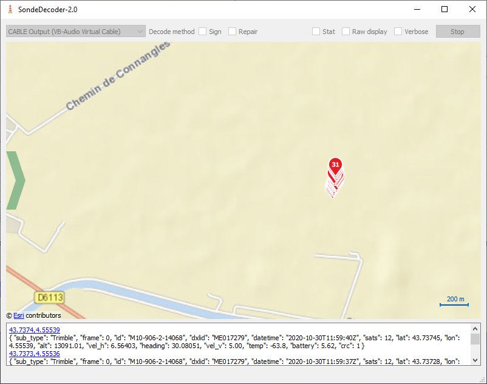

# sonde-decoder

QT application to decode and display M10 messages.

## How to use

- Compile or use released binary.
- Use any SDR and demodulate in FM with 32kHz or more bandwidth.
- Redirect audio to this program (using virtual cable for instance).

## Code quality

- Every rule of the book has been broken to write this program as fast as possible. Do not take any of it as good practice example.

